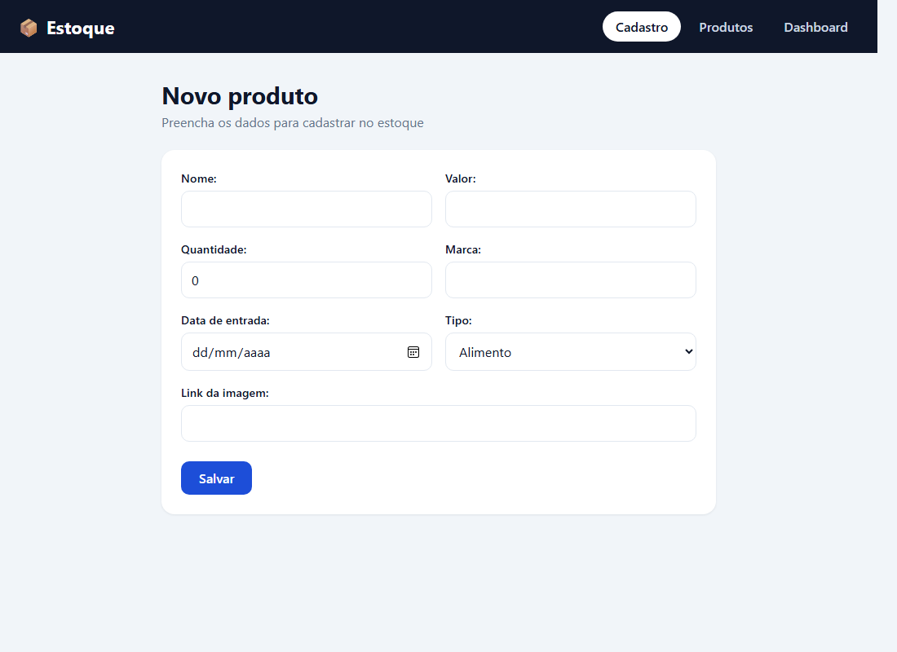
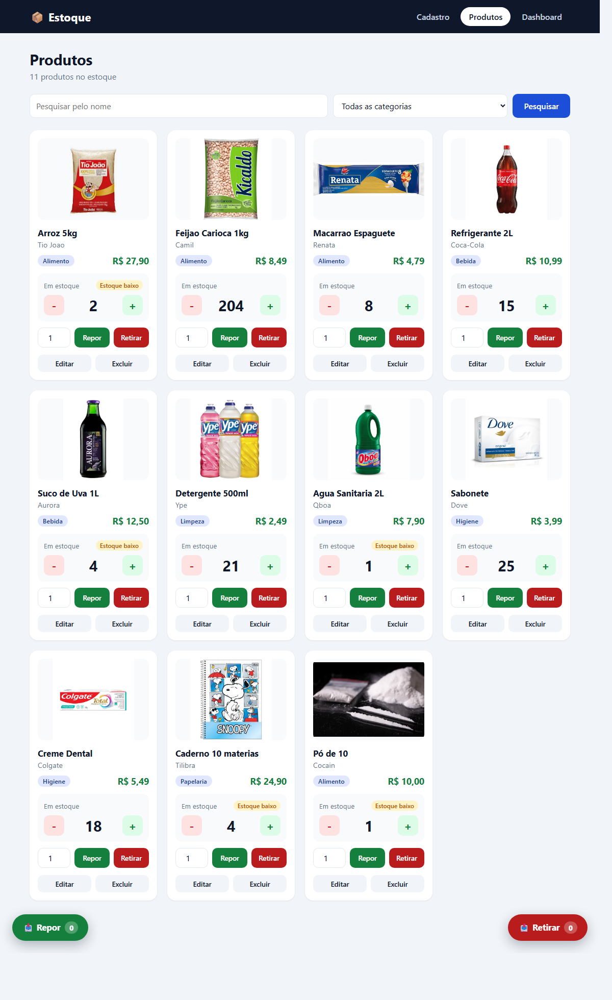
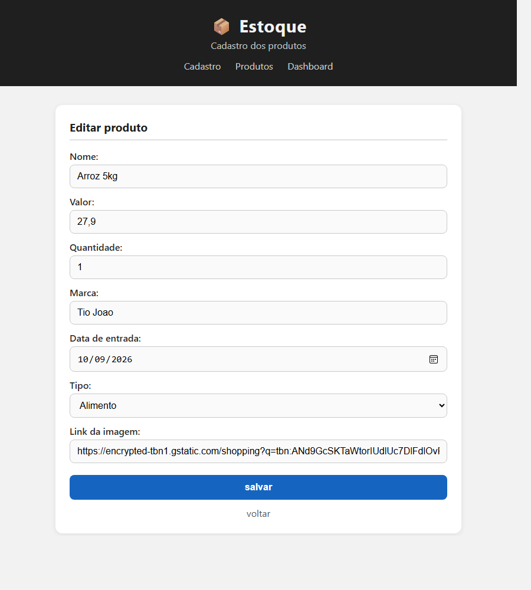
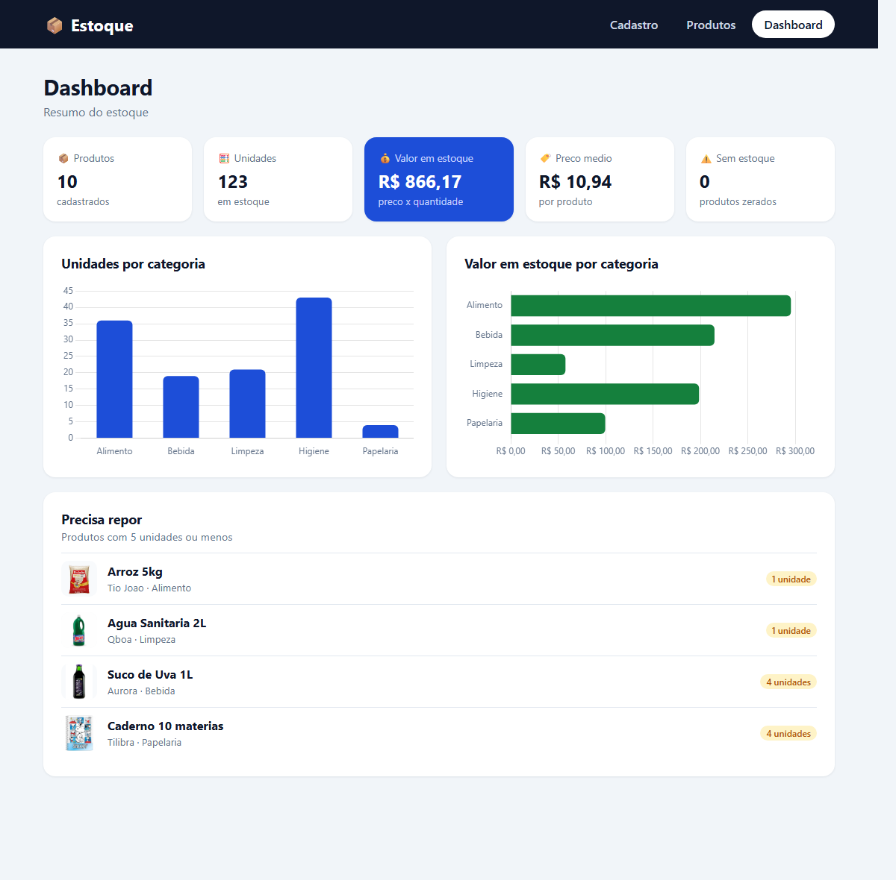

# Estoque

Projeto Django simples para controle de estoque de produtos. Feito para a prova de Django.

## O que faz

- **Cadastro** (`/home`): cadastra um produto (nome, valor, quantidade, marca, data, tipo e link da imagem)
- **Produtos** (`/produtos`): mostra os produtos em cards, com busca pelo nome e filtro por tipo.
  Cada card tem os botoes + e - para ajustar o estoque de 1 em 1 e os links de editar e excluir
- **Entrada e saida do estoque**: cada card tem um campo de quantidade e os botoes **Repor** e **Retirar**,
  que colocam o produto em uma lista. As listas ficam em paineis flutuantes (Repor a esquerda, Retirar a direita)
  com o subtotal de cada item e o total. Ao confirmar:
  - **Repor** soma as quantidades no estoque
  - **Retirar** confere se ainda tem estoque de todos os itens. Se faltar algum, nada e retirado e aparece o motivo
- **Dashboard** (`/dashboard`): numeros do estoque (unidades, valor em estoque, preco medio, produtos zerados),
  graficos por categoria e a lista de produtos que precisam de reposicao

## Telas

### Cadastro


### Produtos


### Editar


### Dashboard


## Estrutura

```
estoque/             configuracoes do projeto (settings, urls)
produtos/            app principal
  models.py          model Produto
  forms.py           ProdutoForm (ModelForm) com a validacao do valor
  views.py           cadastro, listagem, editar, excluir, dashboard e as listas de repor/retirar
  urls.py            rotas
  static/produtos/
    style.css        o CSS de todas as telas
  templates/
    cadastro.html
    produtos.html
    editar.html
    dashboard.html
db.sqlite3           banco com os produtos cadastrados
manage.py
```

## Como rodar

Precisa do Python 3.12 ou mais novo.

```bash
python -m venv venv
venv\Scripts\activate
pip install -r requirements.txt

python manage.py runserver
```

No Linux/Mac o segundo comando e `source venv/bin/activate`.

Depois abra http://127.0.0.1:8000/home

O banco (`db.sqlite3`) vai junto no repositorio, ja com os produtos e as imagens cadastrados.

Os graficos do dashboard usam o Chart.js pela internet, entao precisam de conexao para aparecer.
As imagens dos produtos tambem sao links da internet.

## Admin

```bash
python manage.py createsuperuser
```

Disponivel em http://127.0.0.1:8000/admin/

## Model

| Campo | Tipo | Observacao |
|-------|------|------------|
| nome  | CharField | nome do produto |
| marca | CharField | fabricante |
| valor | FloatField | preco, tem que ser maior que zero |
| quantidade | PositiveIntegerField | quantidade em estoque |
| date  | DateField | data de entrada |
| tipo  | CharField | choices: Alimento, Bebida, Limpeza, Higiene, Papelaria |
| imagem | URLField | link da imagem, opcional |
